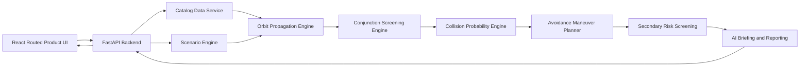

# OrbitGuard High-Level Design

## Product Overview

OrbitGuard is a modular mission-control application for orbital conjunction analysis and autonomous avoidance planning. It combines a cinematic frontend, a Python computation backend, deterministic scenario data, and a documentation-first implementation workflow.

## System Modules

| Module | Responsibility |
|---|---|
| Mission Console Frontend | Presents the routed product shell, 3D globe, mission director strip, catalog workbench, collision tools, system architecture evidence, reports, and learning flow. |
| FastAPI Backend | Exposes APIs, validates requests, orchestrates engines, and returns deterministic scenario results. |
| Catalog Data Service | Loads TLE snapshots, metadata, watchlists, and scenario fixtures. |
| Orbit Propagation Engine | Converts TLEs and time windows into state vectors. |
| Conjunction Screening Engine | Finds candidate close approaches and refines TCA/miss distance. |
| Collision Probability Engine | Estimates Pc from encounter geometry and covariance assumptions. |
| Avoidance Maneuver Planner | Generates and ranks delta-v maneuver candidates. |
| Secondary Risk Screening | Re-screens post-maneuver trajectories for new risks. |
| Scenario Engine | Runs Protect ISRO, 2009 Replay, and Kessler Sandbox. |
| AI Briefing and Reporting | Converts computed metrics into grounded explanations and reports. |
| Demo Mode and Offline Replay | Guarantees deterministic demos without live network dependencies. |
| Testing, Deployment, Observability | Defines test gates, Docker setup, logs, and release readiness. |

## Architecture

## Data Flow

1. User selects Live Mode or a deterministic scenario.
2. Frontend requests catalog/scenario metadata and routes users to Mission Control, Catalog, Predictor, Closest Approach, Reports, System, or Learn.
3. Backend loads TLE snapshots and scenario configuration.
4. Propagation engine computes state vectors over the selected time window.
5. Screening engine finds close approaches and ranks candidates.
6. Collision probability engine estimates risk using documented assumptions.
7. Frontend displays worklist and selected conjunction details.
8. User asks Copilot to plan avoidance.
9. Maneuver planner generates candidate burns and selects the best one.
10. Secondary screening checks the post-maneuver trajectory against the catalog.
11. Reporting layer creates a grounded explanation and audit report.
12. Frontend shows before/after metrics, report output, and system evidence explaining the decision pipeline.

## API Boundary

- `GET /api/health`
- `GET /api/catalogs`
- `GET /api/catalogs/{catalog_id}`
- `GET /api/objects/search`
- `GET /api/watchlists/{watchlist_id}`
- `POST /api/propagate`
- `POST /api/conjunctions/screen`
- `GET /api/conjunctions/{id}`
- `GET /api/scenarios`
- `POST /api/scenarios/{id}/run`
- `POST /api/scenarios/{id}/reset`
- `GET /api/scenarios/{id}/timeline`
- `POST /api/maneuvers/plan`
- `POST /api/maneuvers/apply`
- `POST /api/reports`
- `GET /api/reports/{id}`
- `GET /api/demo/status`
- `GET /api/demo/expected-flow`
- `POST /api/demo/replay/{flow_id}`

All scenario responses must be deterministic so the demo can be replayed exactly.

## Deployment Design

- Local development uses Docker Compose with frontend and backend services.
- Round 1 can run locally from deterministic data.
- Final round can deploy frontend and backend separately.
- Offline demo data must be committed or generated by deterministic scripts.
- No external API should be required for the hero demo.

## Offline Demo Design

Offline mode is a first-class requirement. The app must include committed fixtures for Protect ISRO, 2009 Replay, and Kessler Sandbox. If live catalog refresh fails, the UI must clearly switch to the latest local snapshot without breaking the demo.

## Testing Architecture

### Unit Tests

- TLE parsing.
- Time conversion.
- State-vector math.
- Distance and relative velocity calculations.
- TCA refinement helpers.
- Pc numeric bounds.
- Maneuver candidate ranking.

### Integration Tests

- Catalog loading into propagation.
- Propagation output into conjunction screening.
- Screening output into Pc estimation.
- Pc output into maneuver planning.
- Maneuver result into secondary screening.
- Backend API request/response contracts.

### Scientific Validation Tests

- Known TLE propagation sanity checks.
- Controlled conjunction fixtures with expected TCA ordering.
- Pc monotonicity: risk decreases as miss distance increases under fixed covariance.
- Maneuver improves risk in deterministic fixtures.
- Secondary screening catches deliberately introduced new risk.

### Scenario Tests

- Protect ISRO produces the expected alert, maneuver, and risk reduction.
- 2009 Replay loads historical objects and produces a deterministic story timeline.
- Kessler Sandbox creates debris growth and increased aggregate risk.

### UI and E2E Tests

- App loads and shows the mission console.
- Product navigation reaches Mission Control, Catalog, Collision Predictor, Closest Approach, Reports, System, and Learn routes.
- Scenario can be selected.
- Globe renders object layers.
- Worklist displays ranked alerts.
- Detail panel opens.
- Copilot recommends a maneuver.
- Apply maneuver updates before/after KPIs.
- Report can be generated.
- System Architecture route renders pipeline steps, core engines, validation matrix, and evidence jumps.

### Performance Tests

- Catalog load latency.
- Batch propagation latency.
- Screening latency for protagonist-vs-catalog.
- UI responsiveness while requests are in flight.
- Demo flow completion under 3 minutes.

### Demo Acceptance Tests

- Clean clone can run the deterministic demo.
- Demo works without live internet.
- Protect ISRO story completes end-to-end.
- No visible placeholder text remains in the UI.

## Context and Handoff Strategy

The `context/` folder is mandatory. Each LLD has a matching context file. During implementation, every work session must update:

- `context/CURRENT_STATE.md`
- the active module context file
- `context/DECISIONS.md` or a formal ADR if a durable decision is made

To resume after an interruption:

1. Read `context/CURRENT_STATE.md`.
2. Open the matching LLD.
3. Open the matching context file.
4. Continue from the `Next Step` section.
5. Update context after tests or blockers.

## Round 1 vs Final Round

Round 1 should deliver a polished Protect ISRO vertical slice with enough architecture and methodology to prove seriousness. Final round should deepen the same codebase with stronger science, richer scenarios, reports, performance hardening, and presentation polish.
